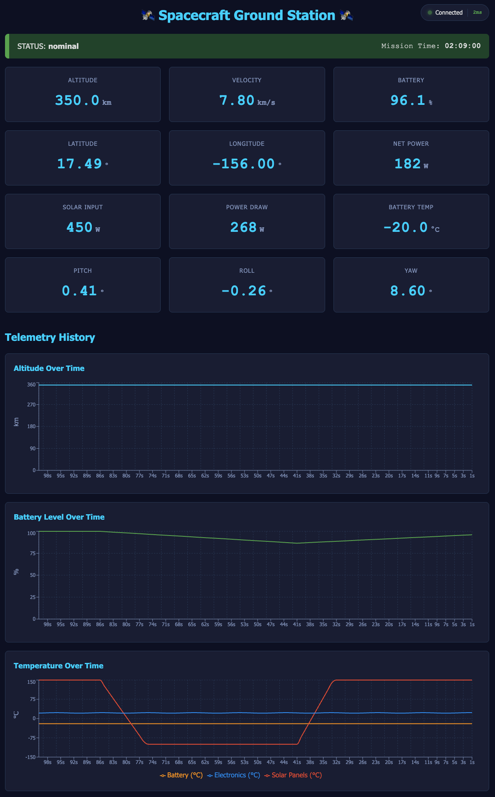
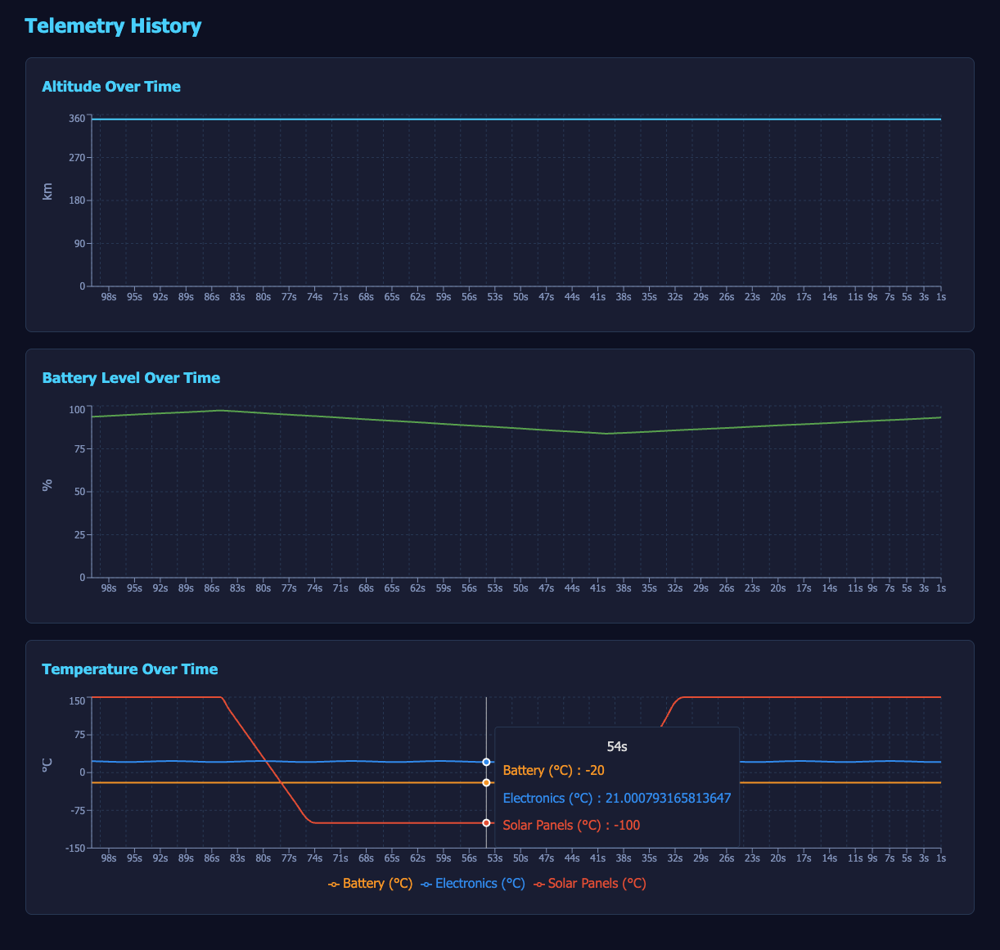
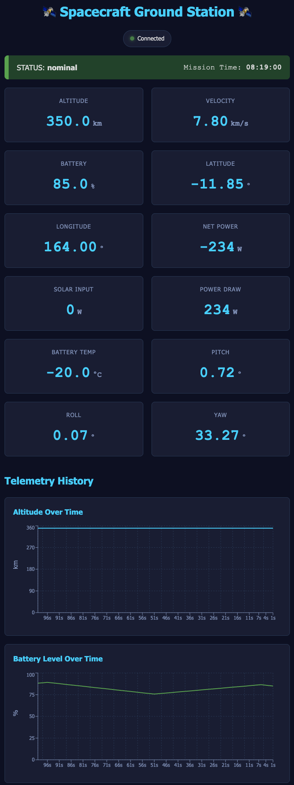

# 🛰️ Spacecraft Ground Station Telemetry Simulator 🛰️

A real-time spacecraft ground station simulator built to learn aerospace ground software engineering through hands-on development.



## About This Project

This is a working spacecraft ground station simulator built from scratch to learn aerospace ground software engineering. It streams real-time telemetry from a simulated LEO spacecraft (modeled after Firefly Alpha Flight 2 - To The Black) to a mission control dashboard, replicating the core workflows of real ground operations.

Built as a self-directed learning project to transition into the aerospace industry and prepare for ground software roles at companies like Firefly Aerospace.

## Quick Start

### Prerequisites
- Python 3.11 or higher
- Node.js 18 or higher
- npm or yarn

### Backend Setup
```bash
# Navigate to backend directory
cd backend

# Create virtual environment
python -m venv ../.venv
source ../.venv/bin/activate  # On Windows: ..\.venv\Scripts\activate

# Install dependencies
pip install fastapi uvicorn pydantic websockets

# Run server
python -m uvicorn app.main:app --reload
```

Backend runs at `http://localhost:8000`

### Frontend Setup
```bash
# Navigate to frontend directory
cd frontend

# Install dependencies
npm install

# Run development server
npm run dev
```

Frontend runs at `http://localhost:5173`

### Access the Dashboard

Open your browser to `http://localhost:5173`

You should see:
- **Connected** indicator (top right or centered on mobile)
- **Status banner** showing system health and mission elapsed time
- **12 telemetry cards** updating every second
- **3 animated graphs** showing 100-second historical data

## Tech Stack

- **Backend:** Python 3.13, FastAPI, WebSockets, Pydantic, Uvicorn  
- **Frontend:** React 18, TypeScript, Recharts, CSS Grid, Vite  

## Architecture & Design Decisions
```
┌──────────────────────┐         ┌──────────────────────┐         ┌──────────────────────┐
│   SPACECRAFT         │         │      BACKEND         │         │     FRONTEND         │
│   SIMULATOR          │         │     (FastAPI)        │         │      (React)         │
│                      │         │                      │         │                      │
│  • Orbit Physics     │────────▶│  • WebSocket Server  │◀────────│  • Dashboard UI      │
│  • Power Budget      │Telemetry│  • Data Validation   │WebSocket│  • Live Graphs       │
│  • Thermal Model     │  1Hz    │  • JSON Serialization│  Stream │  • State Management  │
│  • Attitude Sim      │         │  • Auto-reconnect    │         │  • Responsive Design │
└──────────────────────┘         └──────────────────────┘         └──────────────────────┘
```

### Key Decisions
- **WebSocket streaming:** Persistent connection with 1-2ms localhost latency (vs. HTTP polling overhead)  
- **Telemetry envelope:** Metadata wrapper with timestamps and sequence numbers for latency/packet loss monitoring  
- **Separated simulation:** Physics engine independent from API - enables easy swap to real rocket hardware  
- **Component architecture:** Single-responsibility React components with custom WebSocket hook for state management

## Screenshots

### Full Dashboard

*Live mission control dashboard with real-time telemetry cards and historical graphs*

### Telemetry Graphs

*Time-series visualization showing altitude, battery, and temperature trends*

### Responsive Design

*Mobile-optimized layout with centered connection indicator*

## Features

### Completed

**Phase 1: Real-Time Ground Station**
- [x] Spacecraft simulator with realistic orbital mechanics
- [x] Live telemetry streaming at 1Hz via WebSocket
- [x] Real-time dashboard with 12 telemetry cards
- [x] Three animated time-series graphs showing 100-second history
- [x] Day/night cycle affecting power and thermal systems
- [x] Connection status indicator with latency monitoring
- [x] Automatic reconnection on connection loss
- [x] Responsive design (desktop, tablet, mobile)

### Current Work

**Phase 2: Production Deployment**
- [ ] Docker containerization (backend and frontend)
- [ ] AWS EC2 deployment with Terraform (EC2, networking, security groups)
- [ ] Custom domain with HTTPS (AWS Certificate Manager)
- [ ] CI/CD pipeline with GitHub Actions

### Planned Enhancements

**Phase 3: Data Persistence & Replay**
- [ ] PostgreSQL time-series database (TimescaleDB)
- [ ] Historical telemetry storage and query API
- [ ] Production database deployment
- [ ] Mission replay mode (playback past telemetry)
- [ ] Telemetry export (CSV)

**Phase 4: Command & Control**
- [ ] Uplink command system (ground → spacecraft)
- [ ] Command validation and acknowledgment
- [ ] Spacecraft mode changes (safe mode, science mode, etc.)
- [ ] Multi-spacecraft constellation support

**Phase 5: Enhanced Visualization & Alerts**
- [ ] 3D spacecraft visualization (Three.js)
- [ ] Orbital ground track map (Cesium)
- [ ] Configurable threshold alerts (battery low, temperature high, etc.)
- [ ] Alert panel with active warnings
- [ ] Visual dashboard indicators

## License

MIT License - Feel free to use this as a learning resource or reference for your own projects.

## Author

**Kale Schuetzeberg**
- [kale.schuetzeberg@gmail.com](kale.schuetzeberg@gmail.com)
- [linkedin.com/in/kaleschuetzeberg](https://linkedin.com/in/kaleschuetzeberg/) 
- [github.com/kale-schuetzeberg](https://github.com/kale-schuetzeberg)

---

**Built with a growth mindset and a desire to learn more about spacecraft operations and ground software engineering.**

## Known Issues

### Telemetry Graph Time Scale Mismatch
**Issue:** When the simulator update interval is changed (e.g., `simulator.update(60)` for 1-minute steps), the frontend graphs still display "last 100 seconds" but each data point actually represents the configured time step (60 seconds in this example). This causes the X-axis labels to be misleading - "100s ago" actually means "100 minutes ago" when using 60-second steps.

**Impact:** Graph time scale labels are incorrect when simulator delta time ≠ 1 second  
**Workaround:** Keep simulator at 1Hz (`update(1.0)`) for accurate graph labels  
**Planned Fix:** Phase 3 (or earlier) - sync graph time scale with actual telemetry timestamps