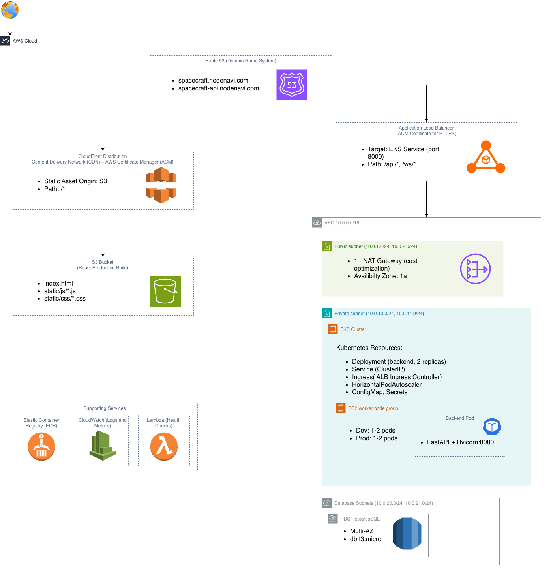

# Spacecraft Telemetry — AWS Architecture

| Field | Value |
|-------|-------|
| Author | Kale Schuetzeberg |
| Last Updated | 2026-03-25 |
| AWS Account | 571252911393 |
| AWS Region | us-east-1 |

Real-time WebSocket telemetry streaming app. React frontend served via CloudFront + S3. Python FastAPI backend running on EKS, exposed via ALB. Infrastructure managed with Terraform, deployed via GitHub Actions.

**Cost:** Dev ~$110/month (spin up on demand), Prod ~$184/month. Largest drivers: EKS control plane ($72), NAT Gateway ($32), ALB ($22).

---

## 1. Architecture

### 1.1 High-Level Diagram



### 1.2 Request Flow

```
STATIC ASSETS (React App):
┌────────┐     ┌─────────┐     ┌────────────┐     ┌────────┐
│ Browser│────▶│ Route53 │────▶│ CloudFront │────▶│   S3   │
│        │◀────│         │◀────│  (cached)  │◀────│        │
└────────┘     └─────────┘     └────────────┘     └────────┘
     spacecraft.nodenavi.com
   (dev.spacecraft.nodenavi.com)
                              Cache HIT: ~10ms
                              Cache MISS: ~50ms


WEBSOCKET TELEMETRY STREAM:
┌────────┐     ┌─────────┐     ┌─────────┐     ┌─────────┐     ┌─────────────┐
│ Browser│────▶│ Route53 │────▶│   ALB   │────▶│   EKS   │────▶│  FastAPI    │
│   JS   │◀────│         │◀────│ (wss://)│◀────│ Service │◀────│  WebSocket  │
└────────┘     └─────────┘     └─────────┘     └─────────┘     └─────────────┘
  spacecraft-api.nodenavi.com                            Persistent Connection
  (dev.spacecraft-api.nodenavi.com)
    │◀────────────────────── Telemetry @ 1Hz ─────────────────────────│


NOTE: spacecraft-api Route53 record is managed by the CI/CD pipeline,
not Terraform. The ALB is provisioned by the Kubernetes Load Balancer
Controller and does not exist at terraform apply time.
```

---

## 2. Networking Reference

| Component | CIDR / Spec | Notes |
|-----------|-------------|-------|
| VPC | 10.0.0.0/16 | |
| Public Subnets | 10.0.1.0/24, 10.0.2.0/24 | ALB, NAT Gateway |
| Private Subnets | 10.0.10.0/24, 10.0.11.0/24 | EKS worker nodes |
| Database Subnets | 10.0.20.0/24, 10.0.21.0/24 | Reserved for RDS (future) |
| NAT Gateway | 1x in AZ-a | Cost optimized — single AZ, not HA |

### Security Groups

| Security Group | Inbound | Outbound |
|----------------|---------|----------|
| ALB-SG | 443 from 0.0.0.0/0 | All to EKS-SG |
| EKS-SG | 8000 from ALB-SG, All from EKS-SG | All to 0.0.0.0/0 |
| RDS-SG | 5432 from EKS-SG | None |

---

## 3. Security

- **Edge**: CloudFront + AWS Shield Standard (automatic), ACM certificates (TLS 1.2+)
- **Network**: VPC isolation, Security Groups, private subnets for all workloads
- **Application**: Kubernetes Network Policy (ingress restricted to :8000), resource limits on all pods
- **Data**: S3 encryption at rest (AWS default), TLS in transit via ACM, IRSA for pod-level IAM permissions

---

## 4. Technology Stack

```
APPLICATION
├── Frontend: React 18, TypeScript, Vite, Recharts
└── Backend:  Python 3.11, FastAPI, Uvicorn, Pydantic, WebSockets

CONTAINERIZATION
├── Runtime:        Docker
├── Registry:       AWS ECR
└── Orchestration:  Kubernetes (AWS EKS 1.35, t3.small nodes)

AWS SERVICES
├── Compute:    EKS, EC2
├── Networking: VPC, ALB, Route53, CloudFront
├── Storage:    S3, ECR
├── Security:   ACM, IAM (IRSA), Security Groups
└── Monitoring: CloudWatch, Container Insights

INFRASTRUCTURE AS CODE  Terraform
CI/CD                   GitHub Actions (OIDC auth to AWS)
```

---

## 5. CI/CD Pipeline

### 5.1 Current State

Three `workflow_dispatch` workflows — all triggered manually. No automated CI stage.

```
┌─────────────────────────────────────────────────────────────────────────────────┐
│                       CI/CD PIPELINE - CURRENT STATE                            │
├─────────────────────────────────────────────────────────────────────────────────┤
│                                                                                 │
│   ┌──────────────────┐                                                          │
│   │ workflow_dispatch │                                                         │
│   └────────┬─────────┘                                                          │
│            │                                                                    │
│            ├──────────────────────────────────────────────────────────────┐     │
│            │                                                              │     │
│            ▼                                                              ▼     │
│   ┌─────────────────────────────────────┐   ┌──────────────────────────────┐    │
│   │           deploy.yml                │   │      tf-plan-apply.yml       │    │
│   │                                     │   │                              │    │
│   │  1. Build + push image to ECR       │   │  job: plan                   │    │
│   │  2. Install cert-manager            │   │    terraform plan            │    │
│   │  3. Install ALB controller (Helm)   │   │       │                      │    │
│   │  4. kubectl apply k8s/              │   │       ▼ (approval gate)      │    │
│   │  5. kubectl set image + rollout     │   │  job: apply                  │    │
│   │  6. Poll for ALB hostname           │   │    terraform apply           │    │
│   │  7. Upsert Route53 CNAME            │   │    auto-update GitHub vars   │    │
│   │  8. npm build → S3 sync             │   └──────────────────────────────┘    │
│   │  9. CloudFront invalidation         │                                       │
│   └─────────────────────────────────────┘   ┌──────────────────────────────┐    │
│                                             │       tf-destroy.yml         │    │
│                                             │                              │    │
│                                             │  job: plan-destroy           │    │
│                                             │    pre-destroy k8s/ALB       │    │
│                                             │    terraform plan -destroy   │    │
│                                             │       │                      │    │
│                                             │       ▼ (approval gate)      │    │
│                                             │  job: destroy                │    │
│                                             │    terraform destroy         │    │
│                                             │    two-phase IAM teardown    │    │
│                                             └──────────────────────────────┘    │
│                                                                                 │
│  GAPs: No CI stage. No prod approval gate on deploy. No HTTP health check.      │
│        No GitHub deployment status notification.                                │
│                                                                                 │
└─────────────────────────────────────────────────────────────────────────────────┘
```

### 5.2 Goal State

```
┌─────────────────────────────────────────────────────────────────────────────────────┐
│                           CI/CD PIPELINE - GOAL STATE                               │
├─────────────────────────────────────────────────────────────────────────────────────┤
│                                                                                     │
│   ┌─────────┐     ┌──────────────────────────────────────────────────────────────┐  │
│   │  Push   │     │                  ci.yml [TODO]                               │  │
│   │  to     │────▶│                                                              │  │
│   │  main   │     │  ┌──────────────┐   ┌──────────────┐   ┌──────────────┐      │  │
│   └─────────┘     │  │     Lint     │──▶│     Test     │──▶│ Scan (Trivy) │      │  │
│                   │  │ ESLint, Ruff │   │Pytest, Vitest│   │ build+scan,  │      │  │
│                   │  │   Prettier   │   │              │   │  no push     │      │  │
│                   │  └──────────────┘   └──────────────┘   └──────────────┘      │  │
│                   └──────────────────────────────────────────┬───────────────────┘  │
│                                                              │ CI must pass [TODO]  │
│              ┌───────────────────────────────────────────────┤                      │
│              │                                               │                      │
│              ▼                                               ▼                      │
│   ┌────────────────────────────┐     ┌──────────────────────────────────────────┐   │
│   │    tf-plan-apply.yml       │     │             deploy.yml [PARTIAL]         │   │
│   │                            │     │                                          │   │
│   │  job: plan                 │     │  job: deploy (prod approval gate [TODO]) │   │
│   │    terraform plan          │     │    1. Build + push image to ECR          │   │
│   │       │                    │     │    2. Install cert-manager               │   │
│   │       ▼ (approval gate)    │     │    3. Install ALB controller (Helm)      │   │
│   │  job: apply                │     │    4. kubectl apply k8s/                 │   │
│   │    terraform apply         │     │    5. kubectl set image + rollout        │   │
│   │    auto-update GitHub vars │     │    6. Poll ALB hostname                  │   │
│   └────────────────────────────┘     │    7. Upsert Route53 CNAME               │   │
│                                      │    8. npm build → S3 sync                │   │
│   ┌────────────────────────────┐     │    9. CloudFront invalidation            │   │
│   │     tf-destroy.yml         │     │   10. HTTP health check [TODO]           │   │
│   │                            │     │   11. GitHub deploy notification [TODO]  │   │
│   │  job: plan-destroy         │     └──────────────────────────────────────────┘   │
│   │    pre-destroy k8s/ALB     │                                                    │
│   │    terraform plan -destroy │                                                    │
│   │       │                    │                                                    │
│   │       ▼ (approval gate)    │                                                    │
│   │  job: destroy              │                                                    │
│   │    terraform destroy       │                                                    │
│   │    two-phase IAM teardown  │                                                    │
│   └────────────────────────────┘                                                    │
│                                                                                     │
└─────────────────────────────────────────────────────────────────────────────────────┘
```

---

## 6. How to Operate

### Bootstrap (first time — run locally)
The IAM role doesn't exist yet so the pipeline can't authenticate. Run Terraform locally first:
```bash
cd terraform/environments/dev
terraform init
terraform apply
```
After apply, manually set `ROUTE53_HOSTED_ZONE_ID` in GitHub env vars (stable, only needed once). All other vars are auto-updated by `tf-plan-apply.yml`.

### Deploy
Trigger `deploy.yml` via GitHub Actions → `workflow_dispatch`. Builds and deploys the backend to EKS and syncs the frontend to S3 in a single run.

### Terraform changes
Trigger `tf-plan-apply.yml` → review the plan job output → approve to apply. Pipeline auto-updates `VPC_ID`, `ACM_CERTIFICATE_ARN`, `CLOUDFRONT_DISTRIBUTION_ID` in GitHub env vars after apply.

### Tear down
Trigger `tf-destroy.yml` → approve. Pipeline handles pre-destroy of k8s/ALB resources and two-phase IAM teardown — IAM roles are deleted last to avoid invalidating the pipeline's own credentials mid-run.

### Stale Terraform lock
If a pipeline run fails mid-apply, the DynamoDB lock may be left behind:
```bash
terraform force-unlock -force <lock-id>
```

---

## 7. Decision Log

| Decision | Options Considered | Choice | Rationale |
|----------|--------------------|--------|-----------|
| Container Orchestration | ECS Fargate, EKS, Raw EC2 | EKS with EC2 nodes | Demonstrates both Kubernetes and EC2 experience |
| Frontend Hosting | Containerized, S3+CloudFront | S3+CloudFront | Cost-effective, faster, industry standard for SPAs |
| Load Balancer | ALB, NLB, API Gateway | ALB | Native WebSocket support, integrates with EKS ingress controller |
| SSL Certificates | Let's Encrypt, ACM | ACM | Free, auto-renewal, native AWS integration |
| CI/CD | Jenkins, GitLab CI, GitHub Actions | GitHub Actions | Already using GitHub, good AWS integration |
| IaC | CloudFormation, Terraform, Pulumi | Terraform | Industry standard, multi-cloud transferable skills |
| Backend DNS | Terraform-managed, Pipeline-managed | Pipeline-managed | ALB is provisioned by k8s Load Balancer Controller after terraform apply — pipeline owns the correct ordering |
| Subdomain structure | Base domain, suffix per env, prefix per env | Environment prefix (`dev.spacecraft.*`) | Prefix scales cleanly as more subdomains are added |
| WebSocket/API routing | All traffic through CloudFront, Split DNS | Split DNS | CloudFront does not reliably support WebSocket connections; ALB is the correct termination point |
| NAT Gateway count | 1 per AZ (HA), 1 total (cost) | 1 total | Cost optimized for dev/demo — single AZ failure risk accepted |

---